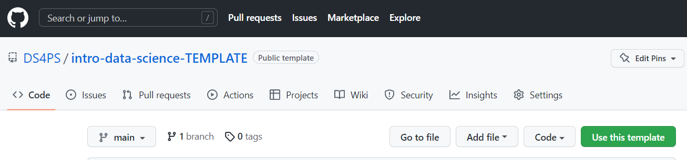
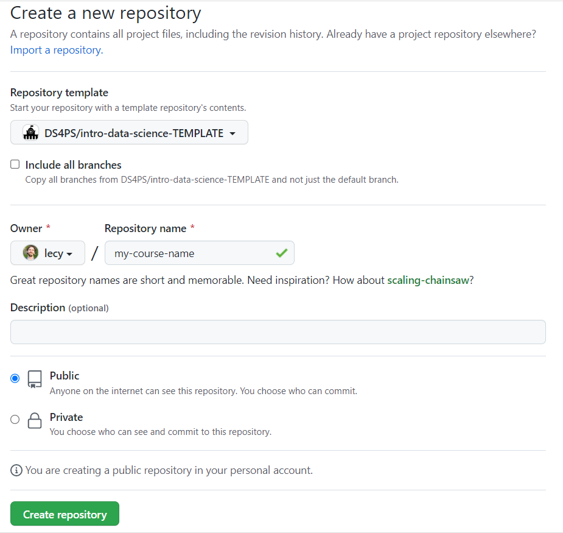
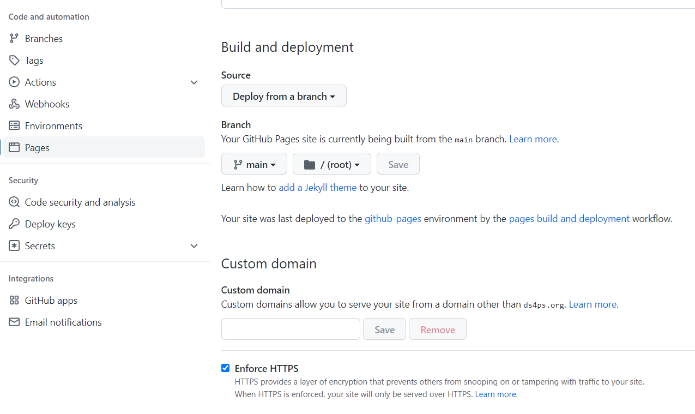
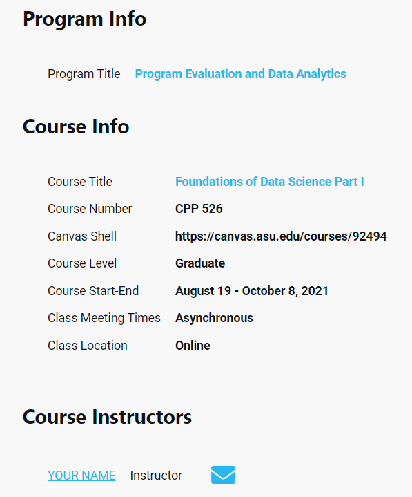
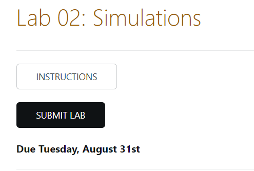

## GitHub Course Template 

This project repository allows instructors to share, adapt, repurpose and extended course material on an introductory data science course. 

Think about it as having access to the "source code" for a classroom. Course material in the repository includes lecture notes, labs, and videos. Multiple instructors have contributed content and it continues to evolve over time. 

Even better, GitHub allows you to turn a repository into a **free course management system** using the templates included with this project: 

* [Syllabus Page](https://ds4ps.org/intro-data-science-TEMPLATE/)
* [Semester Schedule](https://ds4ps.org/intro-data-science-TEMPLATE/schedule/)
* [Lecture Note Example](https://ds4ps.org/intro-data-science-TEMPLATE/units/03-data-viz-static/topic-03x02-plotting-basics.html)
* [Lab Instructions Example](https://ds4ps.org/intro-data-science-TEMPLATE/units/02-operators-and-descriptives/lab-02-instructions.html)
* [Review Session Archive](https://watts-college.github.io/cpp-527-fall-2021/review/)

All of the pages are created as [markdown files](https://ds4ps.org/intro-data-science-TEMPLATE/units/00-foundations/topic-00x03-markdown.html) so that they are easy to customize and maintain. 

The course website templates and all of the course content are open source and free to use.  

You can clone this project, update your course info, and be up and running with a new course website in 20 minutes. GitHub allows you to host your course site for free.  

If you have questions or need help getting started ask anything on the discussion board by creating a new card:  

<!-- Place this tag where you want the button to render. -->
<a class="github-button" href="https://github.com/ds4ps/intro-data-science-TEMPLATE/issues" data-color-scheme="no-preference: dark; light: light; dark: dark;" data-icon="octicon-comment-discussion" aria-label="Discuss ds4ps/intro-data-science-TEMPLATE on GitHub"> ASK A QUESION </a>

----

<br>


### Quick Start Overview

In order to create your own course website you need to complete the following steps: 

1. Select the "use this template" option above to create a new project pre-populated with these course files (see below for details).  
2. Under settings in your new project repo activate the GitHub pages option. 
3. Customize course parameters such as course info, instructor info, and assignment due dates by changing header fields on each page. 

```
# example course parameters on the schedule page
lab-due-dates:
  lab-01:  'Thursday, Aug 26th' 
  lab-02:  'Tuesday, August 31st'
  lab-03:  'Thursday, September 9th'
```

That's it! You are ready to go! 

Once GitHub pages are activated the course will become a live website. 

You can customize the course site pages by editing any of the markdown files in the root folder, such as the syllabus (*index.md*), schedule (*schedule.md*), review sessions (*review.md*), or resources (*resources.md*). You can add as many new pages as you like.  

All of the course content is stored as R Markdown files in the [**units folder**](https://github.com/DS4PS/intro-data-science-TEMPLATE/tree/main/units). They are also fully customizable. 

Explore more details below: 

* [**Create Your Course**](https://github.com/DS4PS/intro-data-science-TEMPLATE#create-your-course)
  - [Activating GitHub Pages](https://github.com/DS4PS/intro-data-science-TEMPLATE#activating-github-pages) 
  - [Website Settings](https://github.com/DS4PS/intro-data-science-TEMPLATE#website-settings) 
  - [Branding](https://github.com/DS4PS/intro-data-science-TEMPLATE#branding)
* [**Customizing Course Pages**](https://github.com/DS4PS/intro-data-science-TEMPLATE#customizing-course-pages)
  - [Creating Custom Fields](https://github.com/DS4PS/intro-data-science-TEMPLATE#creating-custom-fields)
  - [Syllabus](https://github.com/DS4PS/intro-data-science-TEMPLATE#syllabus) 
  - [Schedule](https://github.com/DS4PS/intro-data-science-TEMPLATE#schedule) 
  - [Review Sessions](https://github.com/DS4PS/intro-data-science-TEMPLATE#review-sessions) 
  - [Discussion Boards](https://github.com/DS4PS/intro-data-science-TEMPLATE#discussion-boards)  
* [**Customizing Course Material**](https://github.com/DS4PS/intro-data-science-TEMPLATE#customizing-course-material)
  - [Course Facilitation Guide]()  

<br> 
<hr> 
<br>


## Create Your Course 

This tutorial will walk you through the steps of creating your own course using this project as a template. 

On the top right of this repository select the ”Use this template” (green button). 



<br>

You should see the following dialogue:

<br>
    

    

Select: 

* DS4PS/intro-data-science-TEMPLATE 
* Add a repository name. It’s a good idea to use a name that is similar to your course name and semester offered.
* Public repository 
* There is only one branch, so no need to include all branches. 

The main advantage of using a template is that it copies all of the files to a new project repo on your personal GitHub account. [It is recommended over forking the repository](https://docs.github.com/en/repositories/creating-and-managing-repositories/creating-a-repository-from-a-template). 


<br> 
<hr> 
<br>


### Activating GitHub Pages

You can always view files in a public GitHub repository, but you will want to activate them as a live site for students to access the course.

After you have created a repository for the course on your personal account, navigate to your new project page on GitHub and select:

Settings >> Pages  >> Main Branch >> Root Folder >> "save"

<br> 



 
<br> 

Once pages are activated then all markdown files will be rendered to HTML on the GitHub servers and all HTML files in your repository will now be visible as website pages instead of raw HTML code. 

*The URL for your project will appear at the top of this page after activation. You might need to wait a minute and refresh before it appears.*

<br> 
<hr> 
<br>


### Website Settings

**Global Parameters in config.yml**

The configuration file (config.yml) contains website settings that you must edit for your course site to work properly. 

These include the name of your course, urls directed to your GitHub repository, and information about you and the course.

In the root folder of your new repository click on the **_config.yml** file to edit it. You will see the following code:


```
###
###  COURSE INFO
###

github_info:
    username:       DS4PS   # GitHub account name
    branch:         master
    website-repo:   intro-data-science-TEMPLATE
    course-repo:    intro-data-science-TEMPLATE
 
description:        Intro. course in data science

url:                "https://ds4ps.github.io"
baseurl:            "/intro-data-science-TEMPLATE"
course_url:         "https://ds4ps.github.io/intro-data-science-TEMPLATE/"
title:              ds4ps   # GitHub account name

brand:
    text:           "Intro to Data Science"   
```

Instructor details: 

```      
###
### COURSE INSTRUCTOR:
###

author:
    name:       Professor Who
    github:     doctorprofessorwho   # Github username
```

*More course info and instructor details are provided on the syllabus page.*


And finally, the navigation bar is created by selecting tabs visible on the top and bottom navigation bars. 

The "title" value is the text that will appear on the navigation bar, and the "url" can either be the name of the markdown file (written schedule/ instead of schedule.md), or it can be a full URL to external sites. 

```
###
### NAVIGATION BAR
###

header:
- title: Syllabus
  url:
- title: Course Schedule
  url: schedule/
- title: Review Sessions
  url: review/
- title: Resources
  url: resources/
- title: Get Help
  url: help/
```

<br><hr><br>


### Creating Custom Fields

Fields in the \_config.yml file are unique in that they are global variables, so they can be referenced anywhere in the site.

You can add your own fields, for example a link to an office hours scheduling app. 

```
calendly: 'https://calendly.com/username'
```

You can then add the text `{{site.calendly}}` to any site pages and it will show up as the value `https://calendly.com/username`. 

You can name your new field anything. 

This makes it easy to create course pages once, then only have to edit a handful of parameters the next time you teach the class. 

The page template might have a section like this: 

```
LAB DETAILS
Due date: {{ page.lab-due-date.lab-02 }}
Submission site: {{ page.canvas-url }}
```

And the values defined in the header as:

```
canvas-url: 'https://canvas.asu.edu/courses/99223/assignments'
 
labs-due-date:
  lab-01:  'Thursday, Aug 26th' 
  lab-02:  'Tuesday, August 31st'
```

This convention makes it easy to separate **static course content** (boiler plate text in the syllabus, a reading list) from **dynamic content** that changes each semester, such as due dates, office hours, classroom location, etc. Each page contains parameters in the header to make them easy to update each term. 

Collectively these are called [YAML fields](https://learn.getgrav.org/16/advanced/yaml), and they are in the config.yml file and headers of the course page files like schedule.md, review.md, and index.md (syllabus). 

Fields in a page header can only be referenced within the same page. They are written `{{page.varname}}`.

Parameters in the config file can be referenced anywhere. They are written `{{site.varname}}`. 

<br><hr><br>

### Branding 

There are options to customize the site with some branding from your home university or program. 

The **program-website** parameter in \_config.yml sets the link attached to the sun icon at the top-right of the course navigation bar. Use this parameter to link back to your home program or another site. 

The **demo-logo.png** is a DIY logo that can be made in powerpoint. See the file [program-logo.pptx](https://github.com/DS4PS/intro-data-science-TEMPLATE/blob/main/program-logo.pptx) for an example. Create your own by changing the text and then right-click to save it as a PNG image ("save as image").

Place your logo into the folder **assets/img/logo-name.png** and updated the YAML field accordingly. Currently it is set to **demo-logo.png**. 

```
###
###  YOUR PROGRAM INFO
###

program-logo:       "logo-name.png"
program-website:    "https://ds4ps.org/ms-prog-eval-data-analytics/courses/"
```  

<br><hr><br>


## Customizing Course Pages 

You can customize any page on the site by editing the corresponding markdown file: 

* index.md (syllabus / course landing page) 
* schedule.md  
* review.md  
* help.md 

The following sections detail the course info that has been made into parameters in the header of each file so that it is simple to customize and update. 


### Syllabus 

```
---
layout: index
title: Syllabus

index:
    title: Foundations of Data Science Part I
    image: data-science.png
    subtitle: This course introduces students to the field of data science and its applications in the public and nonprofit sectors. Modern performance management and evaluation processes require strong data literacy and the ability to combine and analyze data from a variety of sources to inform managerial processes. We offer a practical, tools-based approach that is designed to build strong foundations for people that want to work as analysts, data-driven managers, or data-driven journalists. We will cover data programming fundamentals, visualization, text analysis, automated reporting, and dynamic reporting using dashboards. The course is analytically rigorous, but no prior programming experience is assumed.

info:
 program_title: Program Evaluation and Data Analytics
 program_website: 'https://ds4ps.org/ms-prog-eval-data-analytics/courses/'
 course_title: Foundations of Data Science Part I
 course_number: CPP 526
 course_level: Graduate
 course_website: 'https://canvas.asu.edu/courses/xxxxx'
 course_start_end_dates: August 19 - October 8, 2021
 course_prerequisites:  
 class_meets_when:  Asynchronous  
 class_meets_where:  Online
 discussion_board_url: 'https://ds4ps.org/intro-data-science-TEMPLATE/help/'

instructor:
-  name: YOUR NAME
   title: Instructor
   email: EMAIL@asu.edu
   office_location:
   website_url: 'www.google.com'
   github_url:  'https://github.com/'
   twitter_url:
   scholar_url: 'https://scholar.google.com/citations?user=YA43PbsAAAAJ&hl=en&oi=ao'
   linked_in_url:
   office_hours_time: See scheduling app
   office_hours_app_url: 'https://calendly.com'
   office_hours_location: 'Zoom' 
-  name: NAME OF TA
   title: Teaching Assistant
   email: EMAIL@asu.edu
   office_location:
   website_url: 'www.google.com'
   github_url:  
   twitter_url:
   scholar_url: 
   linked_in_url:
   office_hours_time: 'Wednesday 3-5pm'
   office_hours_app_url: 'https://calendly.com'
   office_hours_location: Zoom


textbooks:
- title: R Cookbook, 2nd Edition
  authors: P. Teetor & Teetor, J.
  edition: 2019
  link: https://rc2e.com/
  required: Not Required
- title: R for Data Science
  authors: Wickham, H., & Grolemund, G.
  edition: Free Online
  link: http://r4ds.had.co.nz/
  required: Not Required

...

---
```

<br> 

Once rendered on the syllabus page, the fields will look like this: 

<br> 




<br> <hr> <br>


### Schedule 

```
---
layout: default
title: Schedule

canvas: 
  assignment_url: 'https://canvas.asu.edu/courses/99223/assignments'
  
yellowdig_url: 'https://canvas.asu.edu/courses/99223/assignments/2552420'

yellowdig: 
  post-01: 'Friday, August 20th'
  post-02: 'Friday, August 27th' 
  post-03: 'Friday, September 3rd' 
  post-04: 'Friday, September 10th' 
  post-05: 'Friday, September 17th' 
  post-06: 'Friday, September 24th' 
  post-07: 'Friday, October 4th' 

labs:
  lab-01:  'Thursday, Aug 26th' 
  lab-02:  'Tuesday, August 31st'
  lab-03:  'Thursday, September 9th'
  lab-04:  'Tuesday, September 14th'
  lab-05:  'Tuesday, September 21st'
  lab-06:  'Monday, October 1st'
  
---
```


You can reference YAML variables on the page by placing a YAML reference within double-squiggly brackets. 

YAML variables follow the format: **page.variable-group.variable-name**

For example, the Canvas platform might be used to submit assignments. If the URL is stored as a YAML variable it can be referenced throughout the schedule when assignments are due. Next semester we only have to update the URL once in the YAML header and every other reference on the schedule will use the current URL. 

Written as a YAML field: 

```
canvas: 
  assignment_url: 'https://canvas.asu.edu/courses/99223/assignments'
```

To insert the URL anywhere in the document use: 

```
{{ page.canvas.assignment_url }}
```

For example, the lab due date and submission options are written as follows: 

```
## Lab 02: Simulations  
  
<a class="uk-button uk-button-default" href="../labs/lab-02-instructions.html">INSTRUCTIONS</a>

<a class="uk-button uk-button-primary" href="{{page.canvas.assignment_url}}">SUBMIT LAB</a>

**Due {{page.labs.lab-02}}**
```

And will show up like this on the page: 



 

<br> <hr> <br>


### Review Sessions 


<br>
<hr>
<br>


## Discussion Boards 

https://ds4ps.org/intro-data-science-TEMPLATE/help/

<br><hr><br>


## Page Templates 

Advanced users with a bit of web development experience (HTML/CSS) can modify page templates by adapting the HTML layouts that correspond with each page: 

[HTML LAYOUTS](https://github.com/DS4PS/intro-data-science-TEMPLATE/tree/main/_layouts)

* syllabus / index.md: [index.html](https://github.com/DS4PS/intro-data-science-TEMPLATE/blob/main/_layouts/index.html) 
* schedule.md: [schedule.html](https://github.com/DS4PS/intro-data-science-TEMPLATE/blob/main/_layouts/schedule.html)
* review.md: [review.html](https://github.com/DS4PS/intro-data-science-TEMPLATE/blob/main/_layouts/review.html)
* help.md: [discussions.html](https://github.com/DS4PS/intro-data-science-TEMPLATE/blob/main/_layouts/discussions.html)

These templates use HTML page design combined with **jykell* and **liquid tags** conventions used by GitHub pages. For a simple example of how jykyll + liquid tags work see:

[Barebones Jekyll Site](http://ds4ps.org/barebones-jekyll/index)

Other discrete HTML components like headers, footers, and features like discuss options are in the includes folder: 

[HTML INCLUDES FOLDER](https://github.com/DS4PS/intro-data-science-TEMPLATE/tree/main/_includes)

# Customizing Course Material

Most of the lectures and labs were created as [data-driven documents](https://ds4ps.org/intro-data-science-TEMPLATE/units/00-foundations/topic-00x04-data-driven-docs.html) using R Markdown. 

[R Markdown is a powerful communication tool](https://ds4ps.org/intro-data-science-TEMPLATE/units/00-foundations/topic-00x05-rmarkdown-tutorial.html), and a marketable skill for students.

**Updating Content**

You can customize course files by downloading the RMD files, editing, and saving updated versions back to the project repository. 

The easiest way to do this is adding the repository to your local machine by **cloning** the repo. 

You can then edit R Markdown files in the **units** folder, knit them to create new HTML files, then sync those files back to GitHub. 

The process is very similar to something like DropBox, which allows you to have a local copy of files and a copy in the cloud. I would recommend using the [GitHub desktop tool](https://desktop.github.com/), which makes these steps easy. 

**Cloning  in GitHub Desktop**

> File >> Clone repository 

Use the URL of your GitHub repository (for example, https://github.com/DS4PS/intro-data-science-TEMPLATE) and save the project folder in your preferred local directory. 

**Syncing Files**

After local files have been updated you send the updates to GitHub using: 

> commit ("commit to main") >> push ("push to origin") blue buttons 


In this way all of the course material can be adapted or extended as you wish. 


<!-- Place this tag in your head or just before your close body tag. -->
<script async defer src="https://buttons.github.io/buttons.js"></script>
