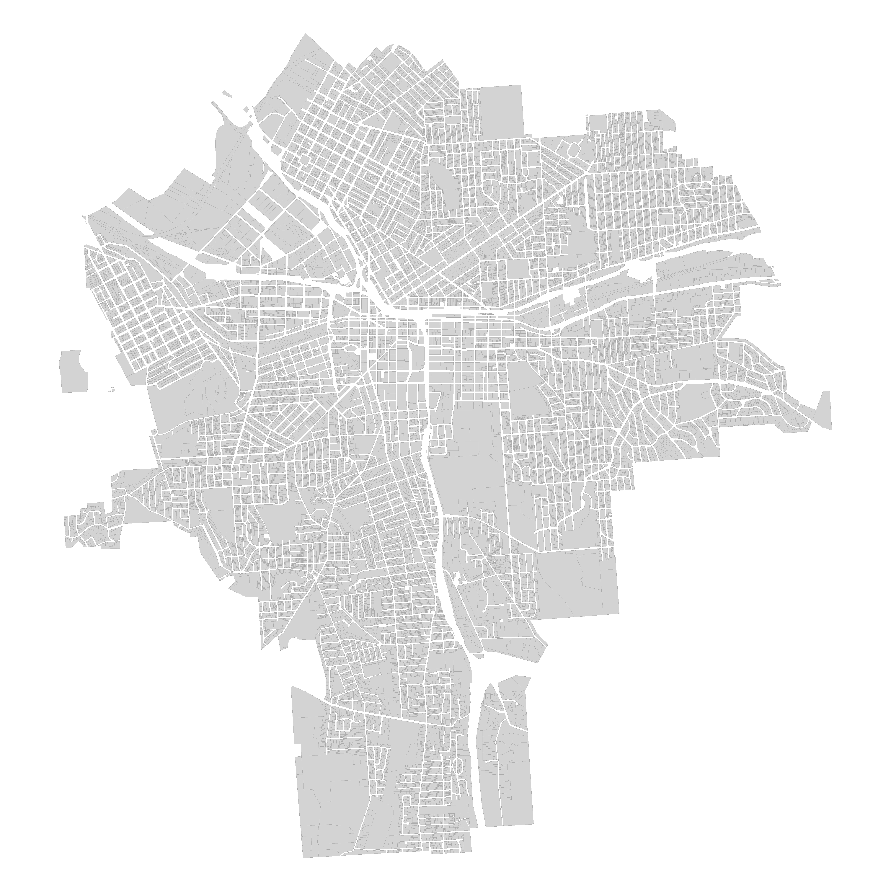

```{r setup, include=FALSE}
knitr::opts_chunk$set(echo = TRUE, message=F, warning=F )

library( dplyr )
library( pander )
```


## About

This dataset represents approximately 42,000 tax parcels for the city of Syracuse, NY. Each row represents a unique parcel of land within city limits.

The dataset is available in the [DataCuse OPEN DATA PORTAL](http://data.syrgov.net/datasets/1b346804e1364a5eb85ccb53302e3c91_0).

"Parcel dataset created by the Department of Neighborhood and Business Development. This dataset includes a large amount of information about each parcel (or area of land for properties) in the city."

```{r, fig.cap="Syracuse Parcels", echo=F, fig.width=10, fig.align="center" }

```

<br>

```{r, fig.cap="Downtown Syracuse", echo=F, out.width="600px", fig.align="center" }
knitr::include_graphics( "img/downtown_syr.png" )
```


<br><br>

## Data Dictionary

This data set contains the following variables:

VARIABLE | DESCRIPTION
-------- | ----------------------
**tax_id**  |  unique parcel ID  (numeric)  
**neighborhood**  |  city neighborhood for tax parcel (character) 
**stnum**  |  parcel address (numeric) 
**stname**  |  parcel address (character) 
**zip**  |  parcel address (numeric) 
**owner**  |  property owner (character) 
**frontfeet**  |  length of the front of the lot (numeric)    
**depth**  |  depth of the lot (numeric)
**acres**  |  size of the parcel in acres (numeric)
**yearbuilt**  |  year of construction for the building on the parcel (numeric) 
**age**  |  age of the building (numeric)
**age_range**  |  age of the building by decade (factor)  
**land_use**  |  zoning purpose of the parcel (factor) 
**units**  |  number of units in multi-unit buildings (numeric)        
**residential**  |  is the parcel zoned for residential (T/F)  
**rental**  |  is the residential space zoned for rental (T/F) 
**vacantbuil**  |  is the building vacant (T/F)   
**assessedla**  |  assessed value of the parcel land  (numeric)
**assessedva**  |  assessed value of the parcel land plus buildings (numeric) 
**tax.exempt**  |  is the parcel tax exempt (T/F)   
**countytxbl**  |   value of parcel for tax purposes (numeric)  
**schooltxbl**  |  value of parcel for tax purposes (numeric) 
**citytaxabl**  |  value of parcel for tax purposes (numeric)   
**star**  |  does the parcel qualify for a residential tax break (T/F)      
**amtdelinqu**  |  amount of tax bill that is delinquint (numeric) 
**taxyrsdeli**  |  length of time tax bill is delinquint (numeric) 
**totint**  |  total interest owed for delinquint taxes (numeric) 
**overduewater**  |  total owed on overdue water bills (numeric) 

<br><br>

## Load Dataset

We are using a number of variables from the 2015 extract of tax parcels saved as a CSV file on GitHub for easy loading:

```{r}
URL <- "https://raw.githubusercontent.com/DS4PS/Data-Science-Class/master/DATA/syr_parcels.csv"
dat <- read.csv( URL, stringsAsFactors=FALSE )

head( dat ) %>% pander

```


<br><br>

## Parcel Shapefiles

The shapefile has been converted to a geojson format, and is available on GitHub:

```{r, eval=F}
library( geojsonio )
library( sp )
library( rgdal )

syr <- geojson_read( "data/syr_parcels.geojson", what="sp" )
plot( syr,  border=NA, col="gray80" )
```

<br><br>


## Neighborhoods

<br><br>

```{r, fig.width=10, fig.height=30, echo=F}


library( geojsonio )
library( sp )
library( rgdal )

syr <- geojson_read( "data/syr_parcels.geojson", what="sp" )

d2 <- dat
dat <- as.data.frame( syr )


# sedgwick <- ifelse( syr$Nhood == "Sedgwick", "red", "gray" )
# plot( syr,  border="gray80", col=sedgwick, main="Sedgwick Neighborhood" )

par( mar=c(0.5,0.5,1,0.5) )
par( mfrow=c(8,4))

nhoods <- unique( syr$Nhood )

nhoods <- na.omit( nhoods )

for( i in nhoods )
{
  
  hood <- ifelse( syr$Nhood == i, "red", "gray80" )
  plot( syr,  border=NA, col=hood, main=paste(i,"Neighborhood") )

}

```

<br><br>


## Downtown

```{r}

# sp package doesn't allow subsets when NAs present:
# replace all NAs with blanks fields 

syr$Nhood <- as.character(syr$Nhood)
syr$Nhood[ is.na(syr$Nhood) ] <- ""

downtown <- syr[ syr$Nhood == "Downtown" , ]
plot( downtown )

table( downtown$LandUse ) %>% pander()


these <- downtown$Acres > 1                                    # define your group
group.colors <- ifelse( these, "firebrick", "gray80" )         # don't change this
par( mar=c(0,0,0,0) )
plot( downtown,  border=NA, col=group.colors )                 # don't change this

names(downtown) <- tolower( names(downtown) )

# geojson_write( input=downtown,  geometry = "polygon", file="downtown-syr.geojson" )

```


## Land Use

```{r, echo=F, fig.width=10, fig.height=12, eval=T}


par( mar=c(1,0.5,1,0.5) )
#par( mfrow=c(7,2))

# vacant <- rep( "gray80", nrow(dat) )
# vacant[ dat$LandUse == "Vacant Land" ] <- "red" 
vacant <- ifelse( dat$LandUse == "Vacant Land", "red", "gray80" )
plot( syr,  border=NA, col=vacant, main="Vacant Land" )


single.family <- rep( NA, nrow(dat) )

gray.red <- rep( "gray80", nrow(dat) )

single.family[ dat$LandUse == "Single Family" ] <- "red" 

gray.red[ dat$LandUse == "Single Family" ] <- "red" 

plot( syr,  border=gray.red, col=single.family, main="Single Family Homes" )


apartment <- rep( "gray80", nrow(dat) )

apartment[ dat$LandUse == "Apartment" ] <- "red" 

plot( syr,  border=NA, col=apartment, main="Apartments" )


parking <- rep( "gray80", nrow(dat) )

parking[ dat$LandUse == "Parking" ] <- "red" 

plot( syr,  border=NA, col=parking, main="Parking Lots" )


com.ind <- rep( "gray80", nrow(dat) )

com.ind[ dat$LandUse == "Industrial" | dat$LandUse == "Commercial"  ] <- "red" 

plot( syr,  border=NA, col=com.ind, main="Commercial and Industrial")


park.cem <- rep( "gray80", nrow(dat) )

park.cem[ dat$LandUse == "Schools" | dat$LandUse == "Parks" | dat$LandUse == "Cemetery"  ] <- "red" 

plot( syr,  border=NA, col=park.cem, main="Schools, Parks & Cemetaries" )


landlords <- rep( "gray80", nrow(dat) )

landlords[ dat$LandUse == "Two Family" | dat$LandUse == "Three Family" | 
             dat$LandUse == "Multiple Residence"  | dat$LandUse == "Apartment" ] <- "red" 

plot( syr,  border=NA, col=landlords, main="Rental Units & Apartments" )


comm.services <- rep( "gray80", nrow(dat) )

comm.services[ dat$LandUse == "Community Services"  ] <- "red" 

plot( syr,  border=NA, col=comm.services, main="Community Services" )


utilities <- rep( "gray80", nrow(dat) )

utilities[ dat$LandUse == "Utilities"  ] <- "red" 

plot( syr,  border=NA, col=utilities, main="Utilities" )


religious <- rep( "gray80", nrow(dat) )

religious[ dat$LandUse == "Religious"  ] <- "red" 

plot( syr,  border=NA, col=religious, main="Religious" )


high.price <- rep( "gray80", nrow(dat) )

high.price[ dat$AssessedVa > 100000  ] <- "red" 

plot( syr,  border=NA, col=high.price, main="Property Valued > $100k" )


### PRICE PER ACRE

price.acre <- dat$AssessedVa / dat$Acres

price.acre[ price.acre > 10000000 ] <- NA

# hist( price.acre, col="gray", xlim=c(0,2000000), breaks=1000 )


high.val <- rep( "gray80", nrow(dat) )

high.val[ price.acre > 600000  ] <- "red" 

plot( syr,  border=NA, col=high.val, main="Property Valued > $600k/acre" )


### NON-TAXABLE PARCELS

non.taxable <- rep( "gray80", nrow(dat) )

non.taxable[ dat$LandUse == "Religious" |  dat$LandUse == "Utilities" | dat$LandUse == "Vacant Land" | 
             dat$LandUse == "Parks" |  dat$LandUse == "Recreation" | 
             dat$LandUse == "Community Services" | 
             dat$LandUse == "Schools" |  dat$LandUse == "Cemetery"  ] <- "red" 

plot( syr,  border=NA, col=non.taxable, main="Non-Taxable Properties" )


price.groups <- cut( price.acre, breaks=c(0,200000,400000,600000,800000,1000000,10000000), labels=c("gray90","gray70","gray50","gray30","gray10","steel blue") )

price.groups <- as.character( price.groups )

plot( syr,  border=price.groups, col=price.groups, bg="white", main="Appraised Property Value" )


legend( "bottomright", bg="white",
        pch=19, pt.cex=1.5, cex=0.7,
        legend=c("$1,353k","$164k","$114k","$85k","$82k","$54k"), 
        col=c("steel blue","gray10","gray30","gray50","gray70","gray90"), 
        box.col="white",
        title="Average Property Value" 
       )


# > tapply( dat$AssessedVa, price.groups, mean, na.rm=T )
#    gray10    gray30    gray50    gray70    gray90 
# 163507.99 114350.59  85115.57  82035.95  54325.86


```


